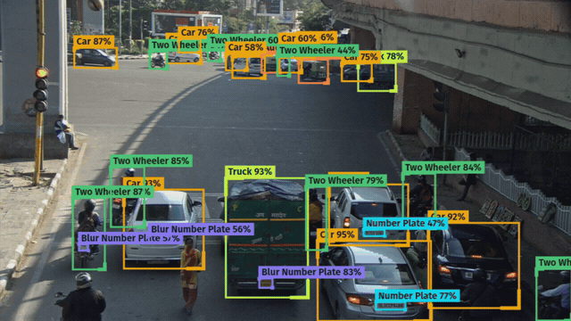

# Traffic Vision



Vehicle and number-plate detection on the Kaggle
[Traffic vehicles Object Detection](https://www.kaggle.com/datasets/saumyapatel/traffic-vehicles-object-detection)
dataset: `Car`, `Number Plate`, `Blur Number Plate`, `Two Wheeler`, `Auto`, `Bus`, `Truck`.

Two pieces. `notebooks/train_colab.ipynb` trains on Colab and exports `best.onnx`.
`web/` is a static page where you drop a video and boxes are drawn on top.

Inference runs entirely in the browser. No video is uploaded anywhere.

## Training

Open `notebooks/train_colab.ipynb` in Colab, set *Runtime → Change runtime type →
T4 GPU*, upload `archive.zip` and run the cells. About 35 minutes.

The notebook is self-contained: unpack, `data.yaml`, train, per-class mAP,
confusion matrix, ONNX export, download.

ONNX sizes: `yolo11n` 10 MB, `yolo11s` 38 MB, `yolo11m` 80 MB. The front-end
downloads the whole file, so the choice shows up as page load time.

The export uses `nms=False` and `dynamic=False`: onnxruntime-web only partially
covers the NMS operators, so `web/detector.js` does the letterbox, decodes the raw
`[1, 11, 8400]` output and runs per-class NMS in JavaScript.

Drop the resulting `best.onnx` into `web/models/`.

## Current model

`yolo11s`, 100 epochs at 640 px, on the 184 validation images:

| class | P | R | mAP50 | mAP50-95 |
|---|---|---|---|---|
| Car | 0.899 | 0.919 | 0.947 | 0.783 |
| Two Wheeler | 0.816 | 0.867 | 0.895 | 0.640 |
| Number Plate | 0.746 | 0.828 | 0.878 | 0.547 |
| Bus | 0.686 | 0.815 | 0.842 | 0.642 |
| Truck | 0.794 | 0.743 | 0.820 | 0.620 |
| Auto | 0.688 | 0.680 | 0.714 | 0.387 |
| Blur Number Plate | 0.617 | 0.764 | 0.719 | 0.383 |
| **all** | | | **0.831** | **0.572** |

Trained on 732 images and 9 153 boxes, validated on 184 and 1 980. The archive's
`test` folder carries no annotations, just 267 raw images and 18 videos. Two of
those videos are `web/demo/sample1.mp4` and `sample2.mp4`.

## Layout

```
notebooks/train_colab.ipynb   training + ONNX export
web/
├── index.html, style.css
├── detector.js               letterbox, decode, NMS
├── app.js                    interface
├── vercel.json               cross-origin isolation headers, required for
│                            multithreaded WASM
├── models/best.onnx
└── demo/                     sample videos
```

Ultralytics YOLO11 is AGPL-3.0.
